Olá, espero que esteja bem !

Alguns dias atrás estava procurando um solução para automatizar a execução dos teste e gerar meus arquivos de deploy de meus aplicativos Flutter. Queria uma solução completa de uma CI/CD, como bom curioso procurei alguns conteúdos na internet e me deparei com o tutorial no canal da Fluterando apresentado pelo Renato Mota, engenheiro da Nubank.

Seguindo os passos tive alguns erros por conta da data de publicação do conteúdo, já faz um tempinho, após conseguir rodar tudo percebi que não estava completo para minhas necessidades, umas das adições a este tutorial é o armazenamento seguro de suas chaves de assinatura em um Bucket S3 na AWS.

Bem chega de enrolação e bora para o conteúdo !

# Requisitos

- Projeto inicial Flutter já com repositório GIT configurado
- Projeto já configurado para gerar o apk e o appbundle assinado
- Uma conta na AWS e conhecimento nos serviços da AWS(IAM, S3, CLI) 

# Configurando CI

1 - Primeiramente vamos criar uma branch de desenvolvimento
````
git branch dev
git checkout dev
````
2 - Agora crie as seguintes pastas a partir da raiz do projeto

````
mkdir .github
cd .github
mkdir workflows
````
Esse caminho é onde o **Github Actions** busca os arquivos de configurações, então garanta que esteja tudo escrito corretamente.

3 - Dentro da pasta **workflows** crie um arquivo chamado **ci.yml**, nesse arquivo vamos especificar as configurações da CI.

4 - No arquivo, vamos especificar o nome da action, essa só será executada quando houver um push e uma pull request na branch dev. Lembrando que você pode estar configurando da maneira que melhor se encaixa no seu fluxo de trabalho e de sua equipe. Também deve-se configurar os passos para execução do job principal que no caso é o **flutter_test**. Caso tenha duvidas ou queira customizar essas etapas de uma olhada na documentação do **Github Actions**. 

**arquivo ci.yml**
````
name: CI
on:
  push:
    branches:
      - dev
  pull_request:
    branches:
      - dev
jobs:
  flutter_test:
    name: Run Flutter analyze and test
    runs-on: ubuntu-latest
    steps:
      # Configura o repositório dentro da imagem do Ubuntu
      - uses: actions/checkout@v2
      # Configura o java com um versão especifica
      - uses: actions/setup-java@v1
        with:
          java-version: "12.x"
      # Configura as dependências do flutter 
      - uses: subosito/flutter-action@v2.16.0
      # Configura um canal e a versão especifica a ser utilizada
        with:
          channel: "stable"
          flutter-version: 3.19.3
      # Obtem as dependências doa aplicativo
      - run: flutter pub get
      - run: flutter analyze
      # Executa o comando de formatar os arquivos e casos algum arquivo seja formatado lança um erro
      # indicando que o código não repeita os padrões estabelecidos
      - run: dart format --set-exit-if-changed lib/
      - run: dart format --set-exit-if-changed test/
      # Executa os testes e gera um arquivo da análise do mesmo
      - run: flutter test --coverage
      - run: flutter test --machine > test-results.json
      # Gera um job que tem como saida os resultados dos test de maneira visual e amigavel
      - uses: dorny/test-reporter@v1
        if: success() || failure()
        with:
          name: Test report results
          path: test-results.json
          reporter: flutter-json
          token: ${{ secrets.GITHUB_TOKEN }}
      # Verifica a porcentagem de cobertura de código
      - uses: VeryGoodOpenSource/very_good_coverage@v3
        with:
          min_coverage: 80
````

5 - Agora salve o seu arquivo e faça o commit/push, navegando até aba **actions** no repositório, então vemos que nossa CI foi executada, entretanto obtivemos um erro, isso
acontece pois não possuímos permissão o sufiente.

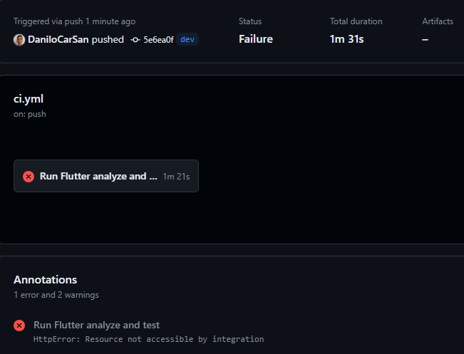

6 - Para dar as permissões adequadas, navegue até **settings** do repositório, e no menu lateral esquerdo clique **actions** depois em **General** e na seção **Workflow permissions** selecione **Read and write permissions** depois clique em salvar alterações.

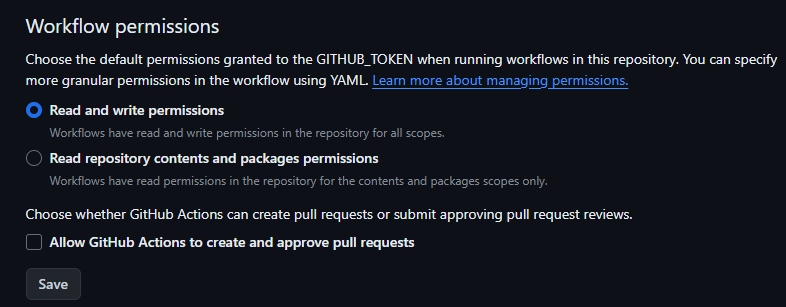

5 - Agora volte para **actions** selecione seu workflow que falhou anteriormente

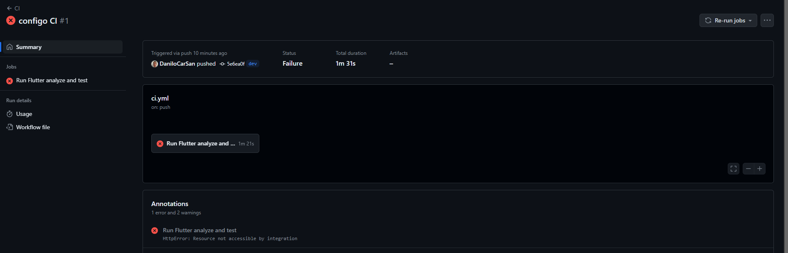

6 - No canto superior direito clique no botão **Re-run jobs** e depois clique em **Re-run all jobs**, seu job será executado novamente aguarde até a execução do mesmo.

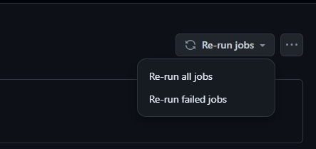

7 -  Seus jobs devem ter executado com sucesso (**Run Flutter analyze and test**)

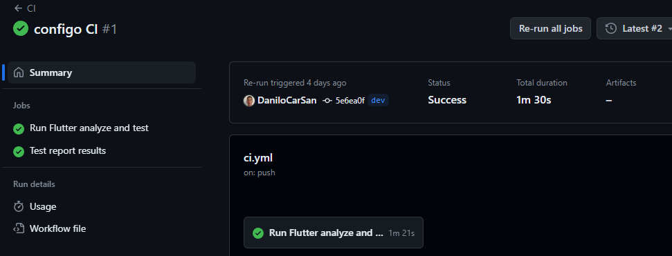

8 - Podemos ver que além do job que especificamos no arquivo de configuração, também temos um job chamado **Test report results** esse job foi criado automaticamente pelo action **dorny/test-reporter@v1**, neste temos um resultado e visualização mais amigável da execução de nossos testes.

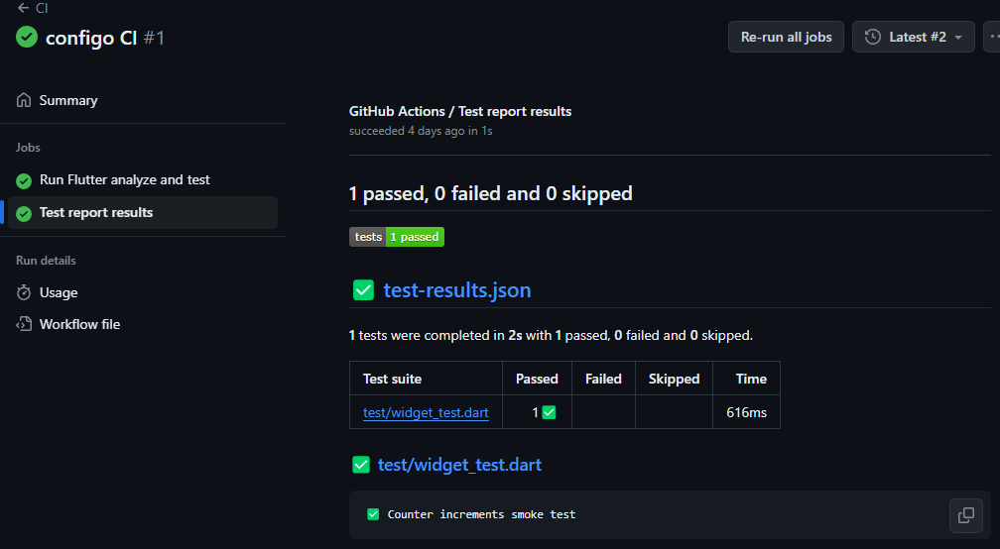

# Configurando assinatura do aplicativo

1 - Não vou abordar os passos para configurar a chave de assinatura aqui, pois estou pressupondo que você já sabe fazer isso, então depois de você ter configurado 
a chave de assinatura, ao executar os comandos abaixo você deve obter seu apk e seu appbundle.

Construir apk
````
flutter build apk --split-per-abi
````

Construir appbundle
````
flutter build appbundle
````
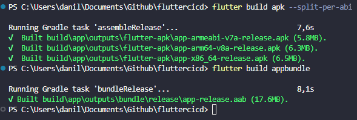

# Configurando CI / CD

Nessa etapa vamos configurar a CI/CD completa onde a CI será encarregada de executar os testes e caso tudo esteja certo então executamos nossa CD, onde geraremos nosso
aplicativo, isto é, o arquivo apk e o appbundle.

1 - Primeriramente duplique o arquivo **ci.yml** criado anteiriormente e remomeie para**ci-cd.yml**

2 - Em nosso arquivo vamos realizar algumas alterações, como adicionar um novo **job** que é responsável por gerar nossos arquivos de build, configurar para que ele sejá
executado apenas quando uma nova release estiver sendo lançada e que essa etapas só sejam executadas se o nosso **job** de execução dos testes tenha sido executado corretamente.

O arquivo deve ficar no seguinte formato abaixo, por hora vamos deixar que nossa **ci/cd** seja executada sempre que aja um commit na branch **dev**
````
name: CI/CD
on:
  push:
    branches:
      - dev
jobs:
  flutter_test:
    name: Run Flutter analyze and test
    runs-on: ubuntu-latest
    steps:
      # Configura o repositório dentro da imagem do Ubuntu
      - uses: actions/checkout@v2
      # Configura o java com um versão especifica
      - uses: actions/setup-java@v1
        with:
          java-version: "12.x"
      # Configura as dependências do flutter 
      - uses: subosito/flutter-action@v2.16.0
      # Configura um canal e a versão especifica a ser utilizada
        with:
          channel: "stable"
          flutter-version: 3.19.3
      # Obtem as dependências doa aplicativo
      - run: flutter pub get
      - run: flutter analyze
      # Executa o comando de formatar os arquivos e casos algum arquivo seja formatado lança um erro
      # indicando que o código não repeita os padrões estabelecidos
      - run: dart format --set-exit-if-changed lib/
      - run: dart format --set-exit-if-changed test/
      # Executa os testes e gera um arquivo da análise do mesmo
      - run: flutter test --coverage
      - run: flutter test --machine > test-results.json
      # Gera um job que tem como saida os resultados dos test de maneira visual e amigavel
      - uses: dorny/test-reporter@v1
        if: success() || failure()
        with:
          name: Test report results
          path: test-results.json
          reporter: flutter-json
          token: ${{ secrets.GITHUB_TOKEN }}
      # Verifica a porcentagem de cobertura de código
      - uses: VeryGoodOpenSource/very_good_coverage@v3
        with:
          min_coverage: 80
  flutter_build:
    name: Build Flutter Android(apk/ appbundle)
    # para ser executada o job dos testes precisa ter executado antes sem erros
    needs: [flutter_test]
    runs-on: ubuntu-latest
    steps:
      - uses: actions/checkout@v2
      - uses: actions/setup-java@v1
        with:
          java-version: "12.x"
      - uses: subosito/flutter-action@v2.16.0
        with:
          channel: "stable"
          flutter-version: 3.19.3
      # Faz o download das dependências do aplicativo
      - run: flutter pub get
      # limpa nossa pasta do build
      - run: flutter clean
      # gera nosso arquivo apk
      - run: flutter build apk --split-per-abi
      # gera nosso arquivo appbundle da google play
      - run: flutter build appbundle
      # faz o upload dos arquivos gerados
      - name: Upload apk
        uses: actions/upload-artifact@v2.1.4
        with:
          name: apk
          path: build/app/outputs/flutter-apk/app-armeabi-v7a-release.apk
      - name: Upload appbundle
        uses: actions/upload-artifact@v2.1.4
        with:
          name: appbundle
          path: build/app/outputs/bundle/release/app-release.aab
````

3 - Agora salve o arquivo **ci-cd.yml** com as alterações e faça o commit/push para o repositorio, depois que você fizer isso, entre nas actions do seu repositório.Você verá que temos duas actions sendo executadas. Nosso foco é na action da **CI-CD**, após entrar nela e esperar que ela seja executada você verá que o job **flutter_build** na etapa **flutter build apk --split-per-abi** falhou com o seguinte erro:

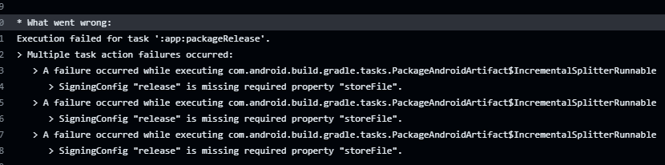

Isso aconteceu pois quando você configurou a chave de assinatura do aplicativo você definiu que buscaria as configurações da chave em um arquivo chamado **key.properties** que se
encontra no caminho **./android/key.properties**, entretando esse arquivo e a chave de assinatura não estão em nosso repositório. Como esse arquivo possui dados sensiveis da
assinatura do nosso aplicativo, não podemos expor ele diretamente, então é recomensável que você o crie na hora do build e a chave você armazene em um local seguro.

# Configurando arquivo key.properties

Nosso arquivo  **key.properties** se parece com isso

````
storePassword=123456
keyPassword=123456
keyAlias=upload
storeFile=upload-keystore.jks
````

1 - Para criar nosso arquivo de configuração na hora do build vamos editar nosso arquivo **CI-CD** no job **flutter_build:** e antes de baixar as depêndencias
**run: flutter pub get** vamos criar uma etapa que crie o arquivo de configuração, copie e cole o código abaixo:

````
- name: Criação do arquivo key.properties
  run: |
    mkdir -p android
    echo "storePassword=${{ secrets.STORE_PASSWORD }}" > android/key.properties
    echo "keyPassword=${{ secrets.KEY_PASSWORD }}" >> android/key.properties
    echo "keyAlias=${{ secrets.KEY_ALIAS }}" >> android/key.properties
    echo "storeFile=${{ vars.STORE_FILE }}" >> android/key.properties
- name: Exibir conteúdo do arquivo temporário
  run: cat android/key.properties
````

No código acima você percebeu que passamos váriaveis na configuração do arquivo, essas variáveis são configuradas no proprópio repositório do Github em um serviço chamado
**secrets** para configurar essa variáveis vamos seguir com os próximos passos.

2 - Navegue até as configurações do seu repositório e na seção **Security** clique na opção **Secrets and variables** e depois em **Actions**

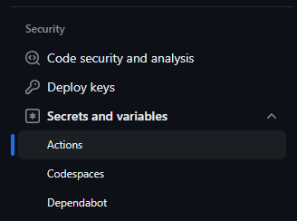

3 - Na página **Actions secrets and variables** selecione a aba **Secrets** e depois logo abaixo na seção **Repository secrets** clique em **New repository secret**

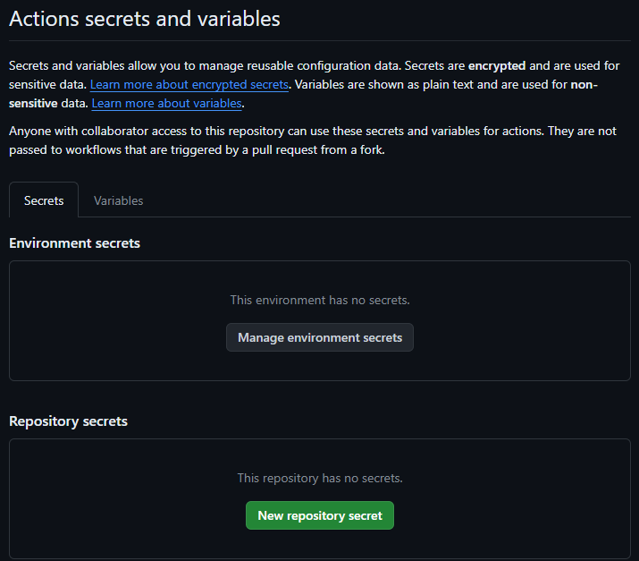

4 - Na tela de criáção dos segredos você deve definir o nome da variável e o valor dela, vamos seguir criando a primeira **STORE_PASSWORD**, depois clique em
adicionar. Faça os mesmo passos para **KEY_PASSWORD** e **KEY_ALIAS**

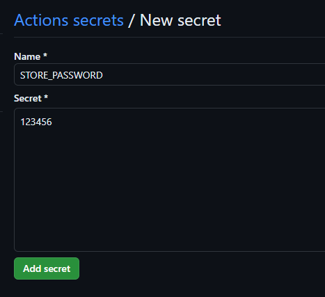

Ao final o resultado deve se parecer com isso:

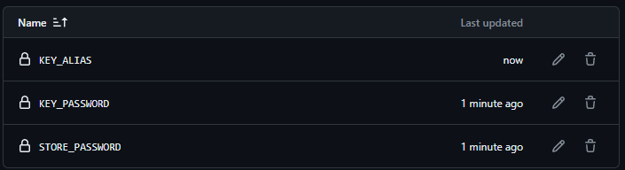

5 - Agora vamos configurar a variável **STORE_FILE**, essa configuração poderia muito bem ser estática ao criar o arquivo **key.properties** mas vamos deixar de modo dinâmico, vai de sua preferência. Como essa não é uma configuração sensivel então podemos criar ela como uma várivel normal. Então volte na pagina das **Actions secrets and variables** e selecione a aba **Variables** e depois logo abaixo na seção **Repository variables** clique em **New repository variable**

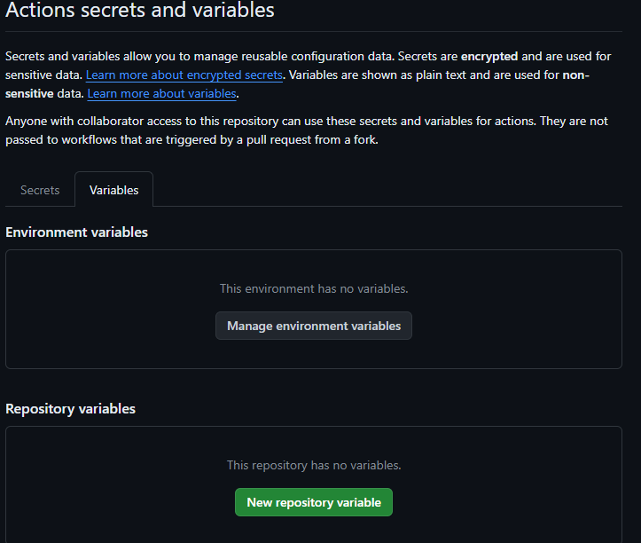

6 - Na pagina de criação da variável, preencha o nome **STORE_FILE** e o valor **upload-keystore.jks**, depois clique em adicionar.

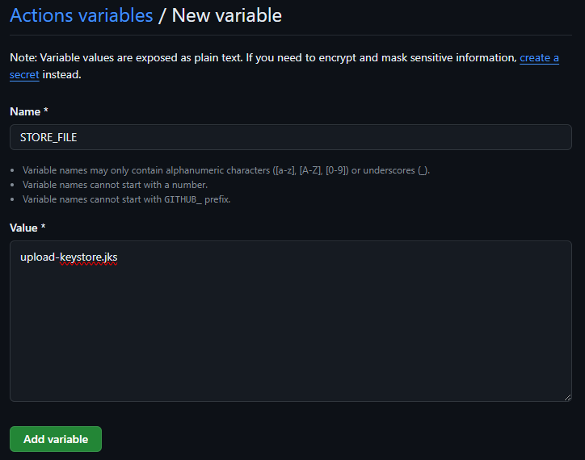

7 - Agora que você adicionou a variável, volte no seu arquivo **ci-cd.yml** edite a linha onde obtemos a variável **STORE_FILE**, para que fique no seguinte formato, depois faça um commit e vá para as **actions** do repostitório para ver o resultado da execução

````
echo "storeFile=${GITHUB_WORKSPACE}/${{ vars.STORE_FILE }}" >> android/key.properties
````

8 - Como você pode ver nossa **action** foi executada, nosso arquivo **key.properties** foi devidamente configurado entretanto obtivemos o seguinte erro:

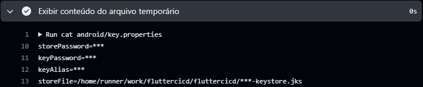

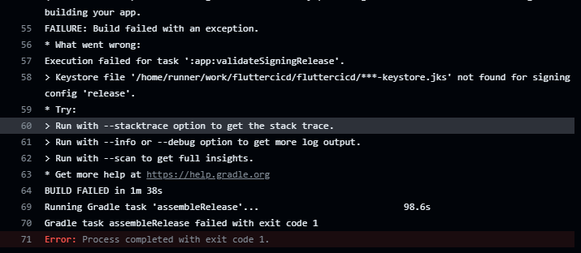

Como você deve ter percebido apesar de termos configurado o arquivo **key.properties** não temos o arquivo pricipal que é nossa chave de assinatura, então antes de executarmos os 
passos de construção e assinatura do aplicativo devemos obter nossa chave de um armazenamento externo, nos próximos passos vamos configurar isso.

# Configurando um bucket S3 na AWS

Nossa chave poderia ter sido convertida em base64 e salva nas **secrets** do Github, entretando as **secrets** tem restrição de tamanho e a parte de conversão para o formato
original é mais complicado de fazer, poderiamos usar uma **action** para isso mas você não quer processos de terceiros tenham acesso a sua chave. Então para solucionar esse problema 
vamos configurar um Bucket S3 na aws para armazenar nossa chave de maneria totalmente segura.

1 - O primeiro passo é entrar na console da AWS, entrar no serviço de S3 e criar um bucket, você pode estar dando o nome de sua preferência. Lembrando que com as configurações padrão
do bucket os seu dados estão totalmente seguros e privado, entretando você pode estar configurando camadas extras de segurança como ativar o versionamento dos objetos, ativar criptografia com o KMS ou bloquear os objetos do S3 apenas para leitura isso vai de sua preferência. Feito os passos, crei o bucket.

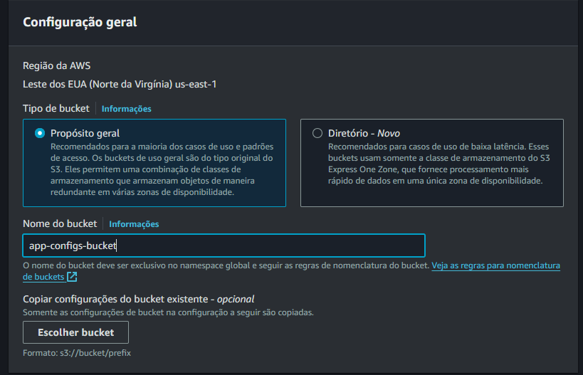

2 - Depois de criádo seu bucket entre nele e crie o seguinte caminho abaixo:

````
apps/[o-nome-do-seu-projeto]
````

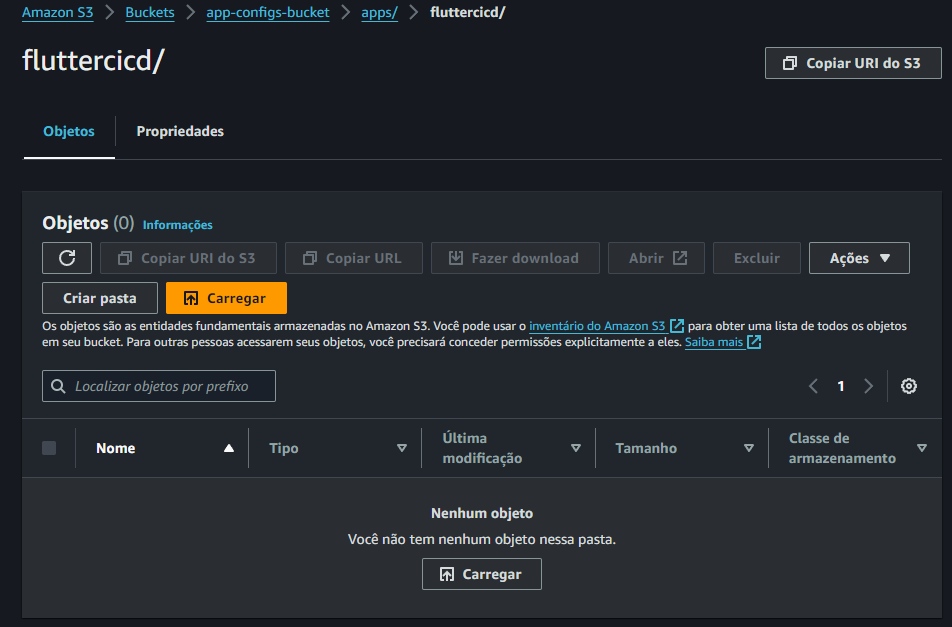

3 - Agora que seu bucket está criádo e a pasta de seu projeto também, faça o upload se sua chave de assinatura para o seu bucket S3 na pasta do projeto

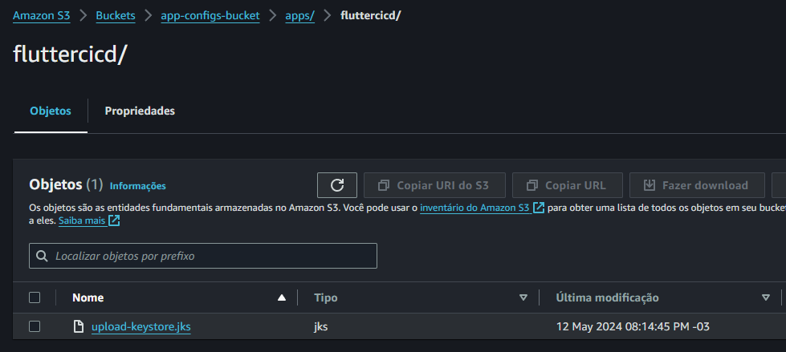

# Configurando um Usuário, Política e Chave de Acesso no IAM

Para que possamos fazer o download da chave na pipeline no Github Actions, temos que ter um **chave de acesso** e para isso primeiramente temos que 
obrigatóriamente criar um usuário, depois disso temos que configurar um política de acesso ao bucket criádo na seção anterior.

## Usuário
1 - Vá até o serviço do IAM, e na página principal do IAM clique em **Usuários**

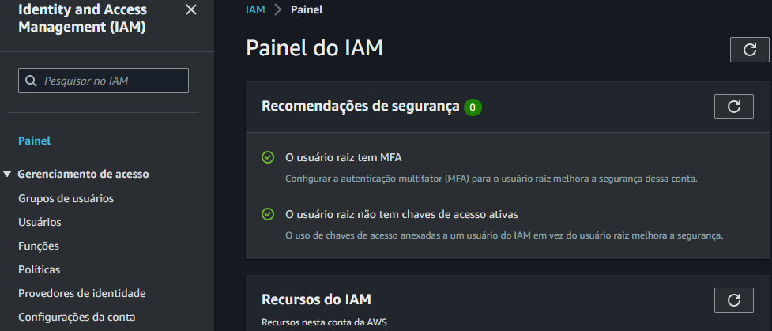

2 -  Na página dos usuários clique no botão **Crial usuário**

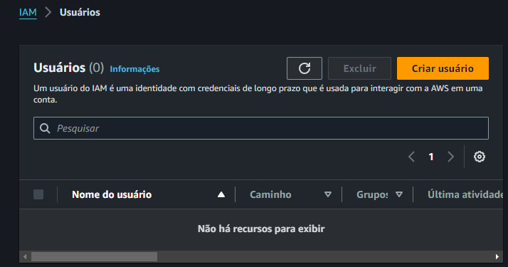

2 - Na página de cadastro do usuário preencha apenas o nome, como este usuário vai ser apenas para afins de acesso via cli, então ele não precisa de acesso a console da
AWS portanto não selecione a opção de acesso a console, depois clique em próximo.

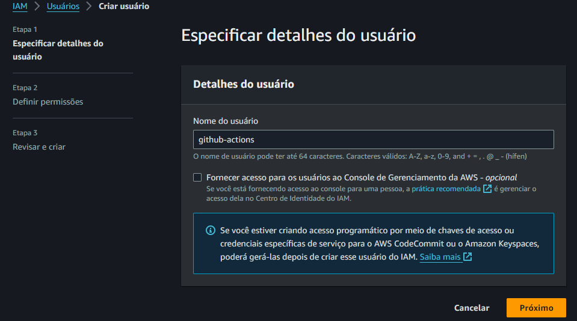

3 - Na próxima etapa **Definir permissões** deixe como padrão a opção **Adicionar usuário ao grupo** e clique em próximo, não vamos vincuar anexar uma política agora pois vamos criar
uma personalizada e depois vincular a este usuário.

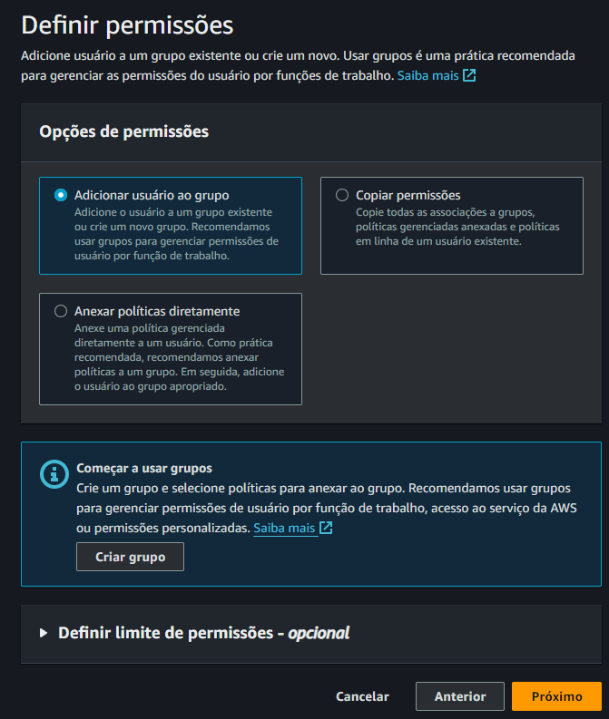

4 - Na última etapa apenas revise as configurações e clique em **Criar usuário**

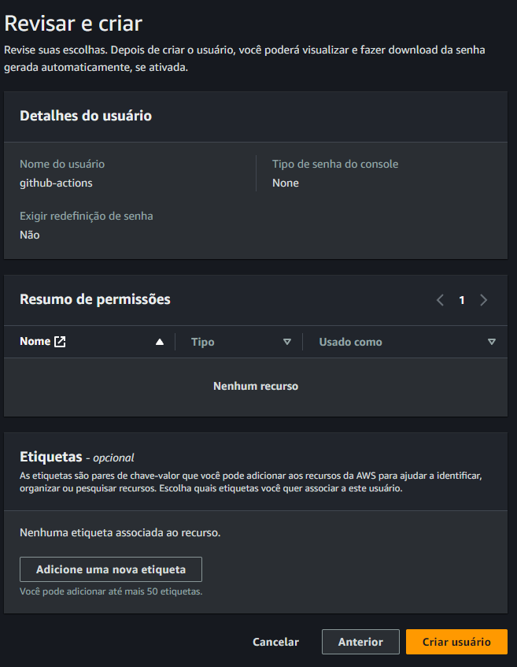

## Política

1 - Para criar um política, volte na página inical do serviço de IAM e depois clique em **Políticas** e depois clique em **Criar política**

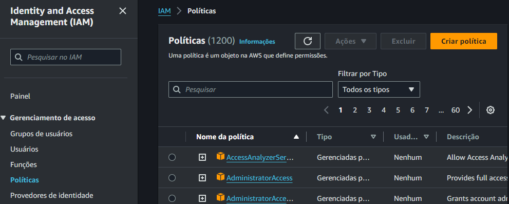

2 - Na página de criação da política clique na aba **json**, copie e cole o json de configuração abaixo. Basicamente está política da acesso a opção de obter objetos do bucket mas apenas no bucket que criamos anteriormente, não se esqueça de alterar o nome do bucket para o que você criou anteriormente. Clique em próximo.

````
{
  "Version": "2012-10-17",
  "Statement": [
    {
      "Effect": "Allow",
      "Action": [
        "S3:GetObject"
      ],
      "Resource": [
        "arn:aws:S3:::SEU_BUCKET_NAME/*"
      ]
    }
  ]
}
````
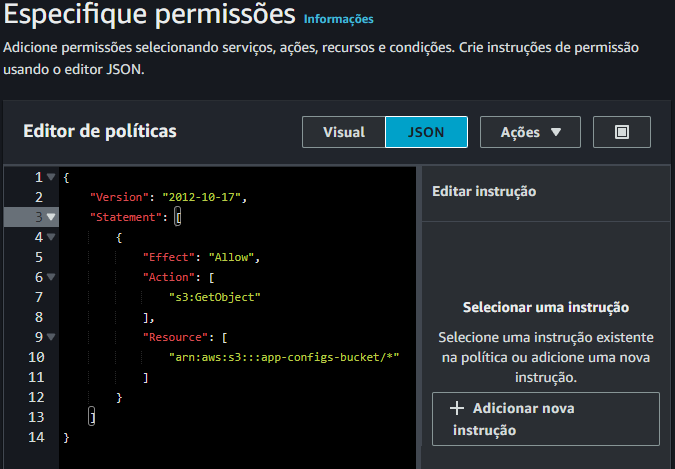

3 - Agora de um nome a sua política confira as demais configurações de depois clique em **Criar política**

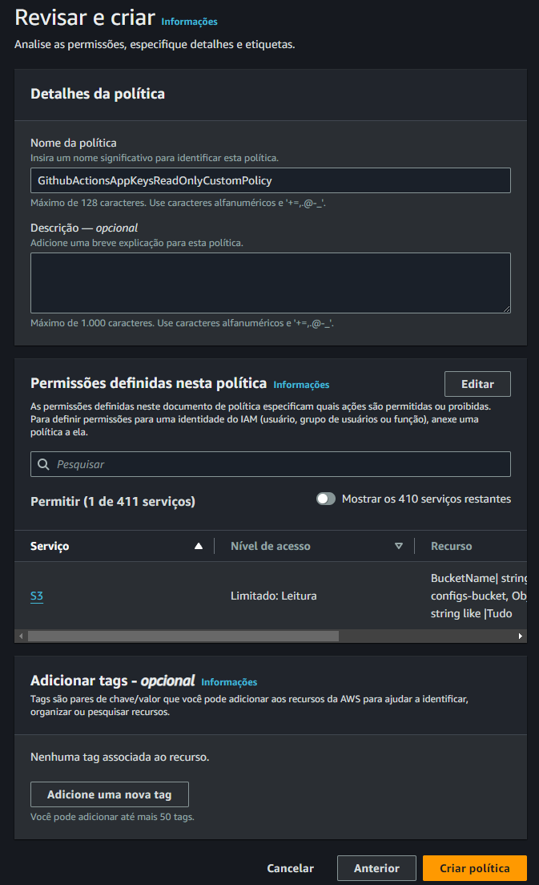

4 - Agora que política foi criada, volte nos usuário e selecione o usuário criádo anteriormente, nas páginas das informações do usuário na aba **Permissões** clique em 
**adicionar permissões**

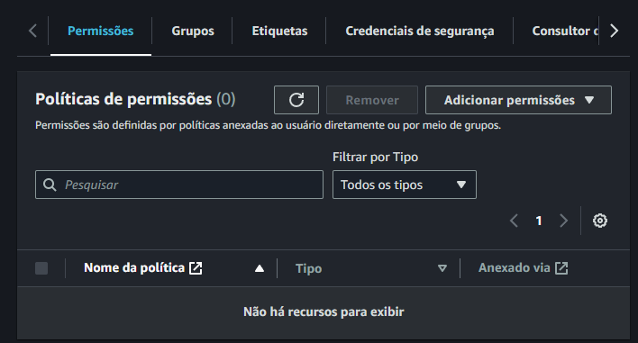

5 - Na pagina onde vamos adicionar ás permissões, selecione a opção **Anexar políticas diretamente**, depois busque pelo nome da política crianda anteriormente **GithubActionsAppKeysReadOnlyCustomPolicy**, selecione está política e clique em **Próximo**.

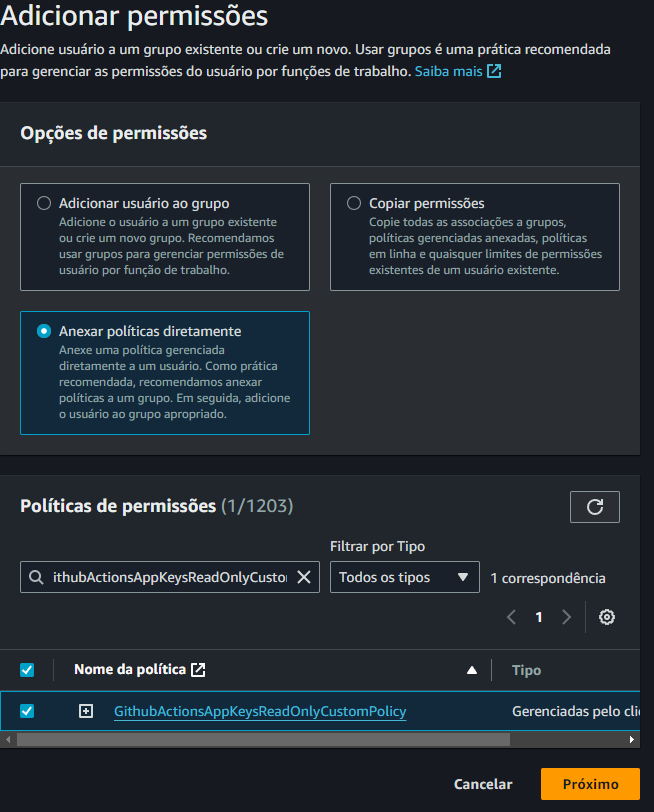

6 - Confirme que você selecionou a política corretamente e clique em **Adicionar permissões** para finalizar

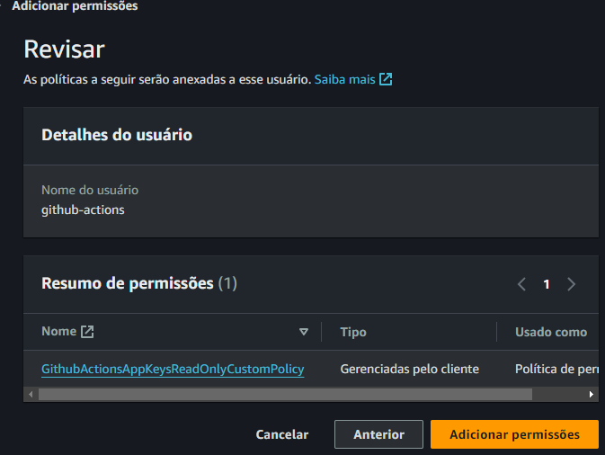

## Chave de acesso

1 - Para criar a chave de acesso, volte no perfil do usuário criado anteriormente e clique na aba **Credenciais de segurança**, depois navegue até a seção **chaves de acesso**
e clique em **Criar chave de acesso**

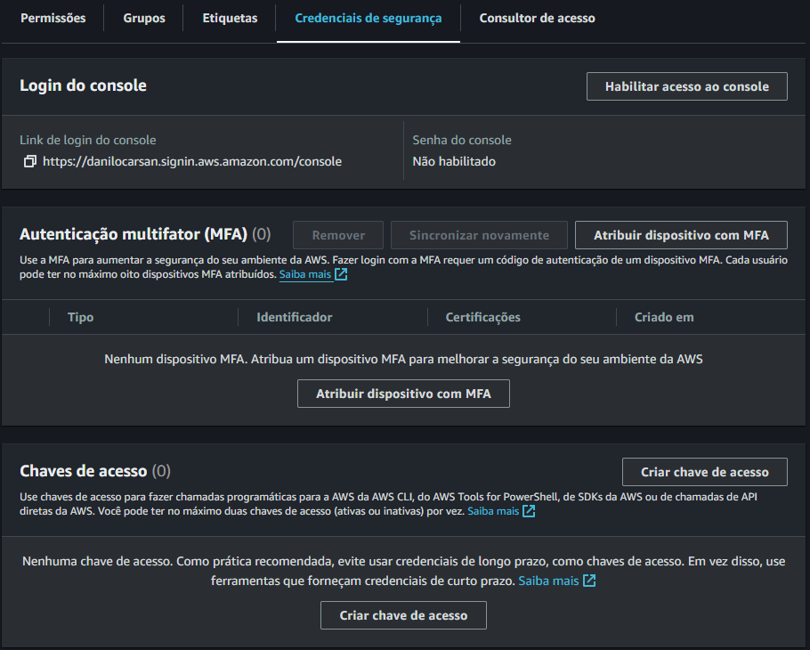

2 - Na primeira etapa em **Casos de uso** você deve selecionar a opção **Command Line Interface (CLI)** pois vamos usar o AWS CLI para poder ter acesso aos recursos da AWS
via linha de comando dentro de nossa pipeline. Depois selecione na opção de aceitação sobre as recomendações e clique em **Próximo**

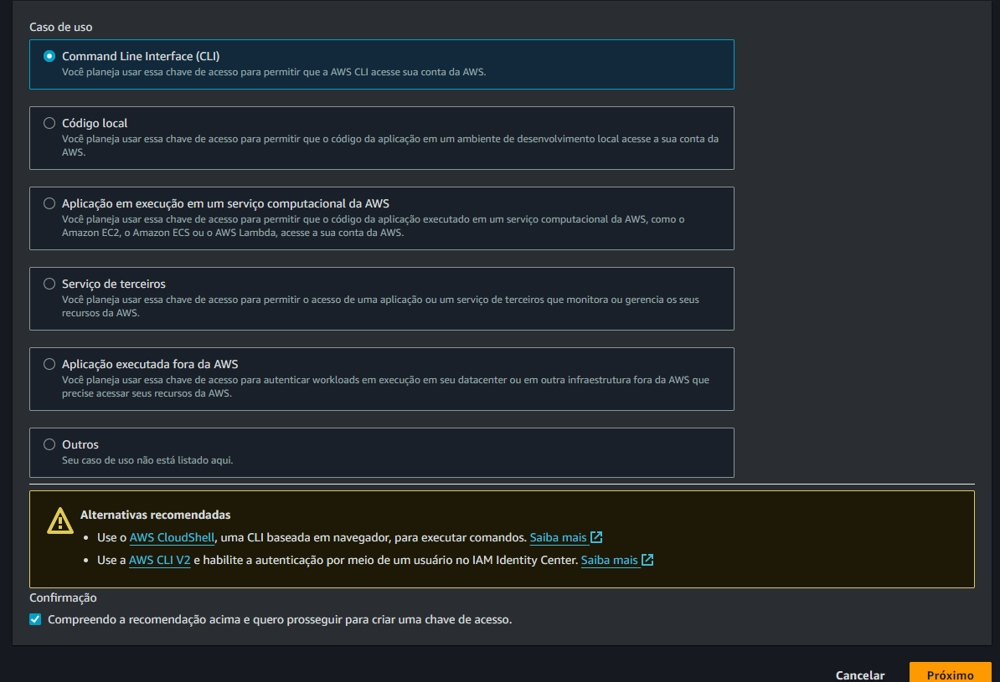

3 - Na última etapa coloque uma descrição do porque da chave para eventuais consultas, depois clique em **Criar chave de acesso**


4 - Após criar a chave de acesso, salve **key** e a **Secret key** para podermos utilizar na configuração do AWS CLi, ou se preferir você pode estar baixando o arquico csv.

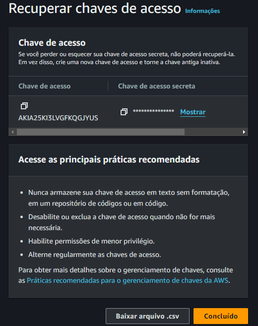

# Configurando Acess key e Secret Key no repositório

Nessa etapa você deve adicionar tanto a **Access Key** como a **Secrete key** nas **Secrets** do seu repositório como fizemos com a **KEY_ALIAS** e **KEY_PASSWORD**. Ao final o resultado deve ficar assim:

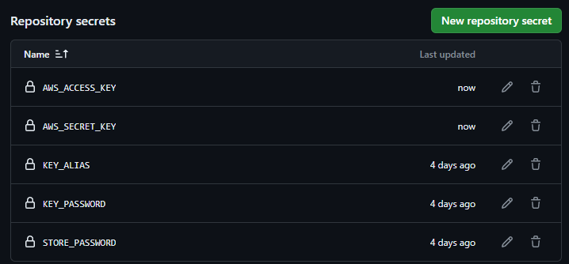

# Configurando AWS CLI

Agora vamos configura a AWS CLI dentro de nossa pipeline para que possamos ter acesso ao recursos da aws, especificamente acesso ao bucket S3 criado anteriormente, vamos configurar
nossas credênciais e a parte de download da chave.

1 - Copie e cole o código dentro da pipelibe **ci-cd** no job **flutter_build** depois da configuração da versão do flutter, não se esqueça de alterar os parametro das **secrets**
para o nome adequado e colocar a região onde você criou seu bucket S3.

````
- uses: aws-actions/configure-aws-credentials@v2
  with:
    aws-access-key-id: ${{ secrets.AWS_ACCESS_KEY }}
    aws-secret-access-key: ${{ secrets.AWS_SECRET_KEY }}
    aws-region: us-east-1
````

2 - Agora vamos adicionar mais um passo para baixar nossa chave diretamente do S3, copie e cole o código abaixo depois do passo de configuração da AWS CLI.

````
- name: Baixar chave de assinatura do bucket S3
  run: aws S3 cp S3://[NOME_DO_SEU_BUCKET]/apps/fluttercicd/upload-keystore.jks upload-keystore.jks
````

Não se esqueça de colocar o mesmo caminho e nome da chave de acordo com a variavel de ambiente **STORE_FILE**, no meu caso a chave será baixada na raiz do meu espaço de trabalho como foi especificado na configurações feitas anteriormente ****.

````
echo "storeFile=${GITHUB_WORKSPACE}/${{ vars.STORE_FILE }}" >> android/key.properties
````

3 - No final de tudo seu arquivo completo **ci-cd.yml** deve se parecer com isso:

````
name: CI/CD
on:
  push:
    branches:
      - dev
jobs:
  flutter_test:
    name: Run Flutter analyze and test
    runs-on: ubuntu-latest
    steps:
      # Configura o repositório dentro da imagem do Ubuntu
      - uses: actions/checkout@v2
      # Configura o java com um versão especifica
      - uses: actions/setup-java@v1
        with:
          java-version: "12.x"
      # Configura as dependências do flutter 
      - uses: subosito/flutter-action@v2.16.0
      # Configura um canal e a versão especifica a ser utilizada
        with:
          channel: "stable"
          flutter-version: 3.19.3
      # Obtem as dependências doa aplicativo
      - run: flutter pub get
      - run: flutter analyze
      # Executa o comando de formatar os arquivos e casos algum arquivo seja formatado lança um erro
      # indicando que o código não repeita os padrões estabelecidos
      - run: dart format --set-exit-if-changed lib/
      - run: dart format --set-exit-if-changed test/
      # Executa os testes e gera um arquivo da análise do mesmo
      - run: flutter test --coverage
      - run: flutter test --machine > test-results.json
      # Gera um job que tem como saida os resultados dos test de maneira visual e amigavel
      - uses: dorny/test-reporter@v1
        if: success() || failure()
        with:
          name: Test report results
          path: test-results.json
          reporter: flutter-json
          token: ${{ secrets.GITHUB_TOKEN }}
      # Verifica a porcentagem de cobertura de código
      - uses: VeryGoodOpenSource/very_good_coverage@v3
        with:
          min_coverage: 80
  flutter_build:
    name: Build Flutter Android(apk/ appbundle)
    # para ser executada o job dos testes precisa ter executado antes sem erros
    needs: [flutter_test]
    runs-on: ubuntu-latest
    steps:
      - uses: actions/checkout@v2
      - uses: actions/setup-java@v1
        with:
          java-version: "12.x"
      - uses: subosito/flutter-action@v2.16.0
        with:
          channel: "stable"
          flutter-version: 3.19.3
      - uses: aws-actions/configure-aws-credentials@v2
        with:
          aws-access-key-id: ${{ secrets.AWS_ACCESS_KEY }}
          aws-secret-access-key: ${{ secrets.AWS_SECRET_KEY }}
          aws-region: us-east-1
      - name: Baixar chave de assinatura do bucket S3
        run: aws S3 cp S3://app-configs-bucket/apps/fluttercicd/upload-keystore.jks  upload-keystore.jks
      - name: Criação do arquivo key.properties
        run: |
          echo "storePassword=${{ secrets.STORE_PASSWORD }}" > android/key.properties
          echo "keyPassword=${{ secrets.KEY_PASSWORD }}" >> android/key.properties
          echo "keyAlias=${{ secrets.KEY_ALIAS }}" >> android/key.properties
          echo "storeFile=${GITHUB_WORKSPACE}/${{ vars.STORE_FILE }}" >> android/key.properties
      - name: Exibir conteúdo do arquivo temporário
        run: cat android/key.properties
      # Faz o download das dependências do aplicativo
      - run: flutter pub get
      # limpa nossa pasta do build
      - run: flutter clean
      # gera nosso arquivo apk
      - run: flutter build apk --split-per-abi
      # gera nosso arquivo appbundle da google play
      - run: flutter build appbundle
      # faz o upload dos arquivos gerados
      - name: Upload apk
        uses: actions/upload-artifact@v2.1.4
        with:
          name: apk
          path: build/app/outputs/flutter-apk/app-armeabi-v7a-release.apk
      - name: Upload appbundle
        uses: actions/upload-artifact@v2.1.4
        with:
          name: appbundle
          path: build/app/outputs/bundle/release/app-release.aab
````

4 - Como passo final faça commit/push das alterações e veja os resultados, nossos teste foram executado com sucesso e tanto o apk quanto o appbundle foram criados.

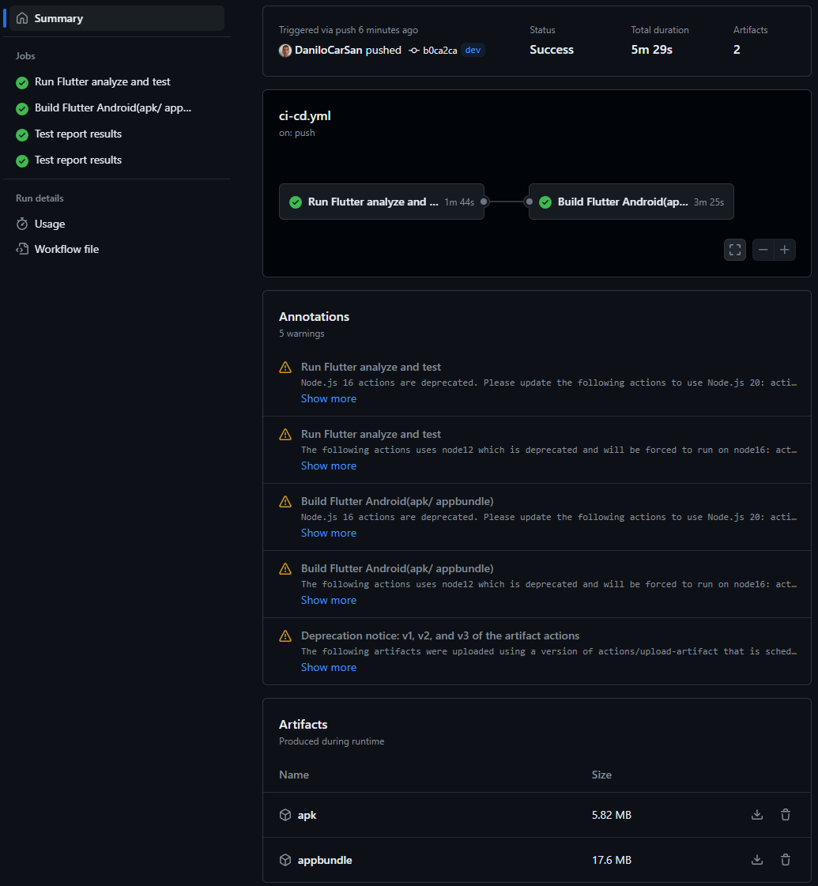

# Recomendações / Melhorias

- Obter o nome do bucket dentro da pipeline atravéz de uma variável de ambiente
- Fazer upload dos arquivos para o bucket S3
- Configurar versionamento no bucket S3
- Criptografar bucket S3 com o KMS
- Alterar a trigger para ser executada quando um release ou tag for criáda na branch main

# Conclusão

Bem é isso, obrigado por ter chegado até aqui, fique avontade para sugerir melhorias e também recomendar próximos posts.

# Referências

- [HttpError: You must authenticate via a GitHub App.](https://stackoverflow.com/questions/70435286/resource-not-accessible-by-integration-on-github-post-repos-owner-repo-ac)
- [Gihub Actions Secret](https://docs.github.com/pt/actions/learn-github-actions/contexts#secrets-context)
- [Renato Mota - Configurando CI/CD com Flutter](https://github.com/RenatoLucasMota/FlutterandoGithubActions)