Olá como anda, se você chegou aqui então provavelmente está procurando um jeito de construir seu blog pessoal e começar a publicar suas ideias e compartilhar seu conhecimento. Como essa é minha primeira publicação, não podia deixar escrever como foi que eu fiz para configurar este blog. 

Lembrando que essa é um solução que não possui tantos recursos como por exemplo um Wordpress, mas é uma ótima solução para começar e com zero custo. Para que isso fosse possível utilizaremos 3 principais ferramentas.

# Ferramentas

### Github Pages

O Github Pages é um serviço do Github que nos possibilita hospedar sites estáticos, comumente utilizado para hospedar documentação dos projetos nos repositórios git, ele nos possibilita renderizar tanto páginas HTML quanto em Markdown.

**Site oficial:** https://pages.github.com/
#### Obsidian

O Obsidian é um aplicativo de anotação, o segredo é que ele gera os arquivo em Markdown uma peça chave para novo propósito.

**Site oficial:** https://obsidian.md/
#### Quartz

O Quartz é um gerador de site estáticos, o pulo do gato é que ele será encarregado de pegar nosso arquivos de anotações gerado em Markdown pelo nosso Obsidian e converterá em HTML, só que ele não faz apenas isso. Ele é customizável e adiciona algumas funcionalidade ao nosso blog como grade de laytout, menus, barra de busca, tema escuro e claro, além de outras customizações que você pode estar fazendo. Se preferir de uma olhada na documentação para mais detalhes e não se esqueça de dar uma estrelinha no repositório do projeto.

**Documentação:** https://quartz.jzhao.xyz/    **Github:** https://github.com/jackyzha0/quartz

# Fluxo de Postagem

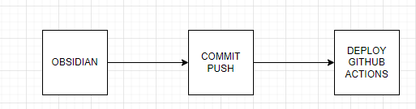

1. Criar/editar seu arquivos no obsidian
2. Fazer o commit e fazer o push para seu repositório online
3. Rodar pipeline no GithubAction para fazer o deploy das alterações

# Configuração do repositório

1 - Para começar primeiramente vamos precisar que você entre no repositório do Quartz e faça um fork do projeto e que o repositório esteja publico. Não esqueça de dar estrelinha no projeto.


Nessa parte é essencial que você coloque o nome se seu usuário do github mais sufixo **.github.io** para que o Github entenda que esse repositório funcionará como um site estático. No meu caso ficara assim, pois já tenho um blog configurado:

```
meublog.github.io
```

No seu caso ficará assim

```
seunomedeusuario.github.io
```

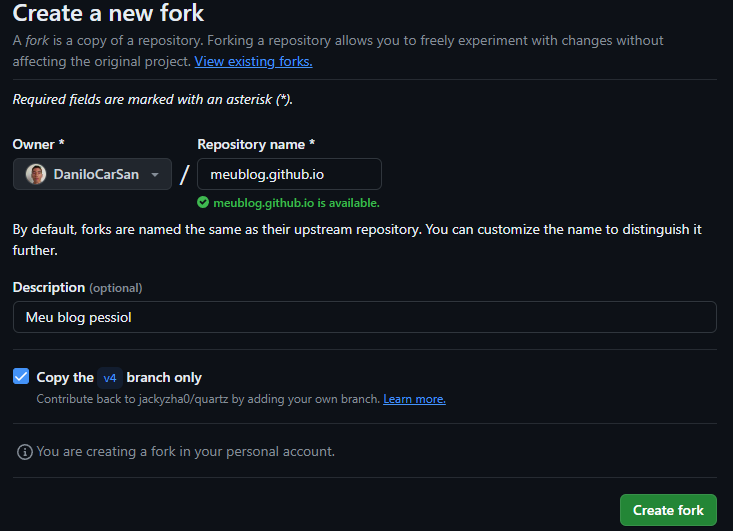

2 - Em seu computador faça o clone de seu repositório no lugar de sua preferencia

```
git clone https://github.com/[seu_usuário]/[seu_repositório]
```

3 - Navegue até pasta de seu projeto e abra ele no seu editor de código favorito, no meu caso estarei utilizando o vscode.

4 - No projeto instale as dependências e rode a aplicação para ver se está tudo rodando normalmente.

````
npm install
npx quartz build --serve
````
Após o último comando se tudo estiver dado certo seu blog deve estar rodando na porta 8080

http://localhost:8080/

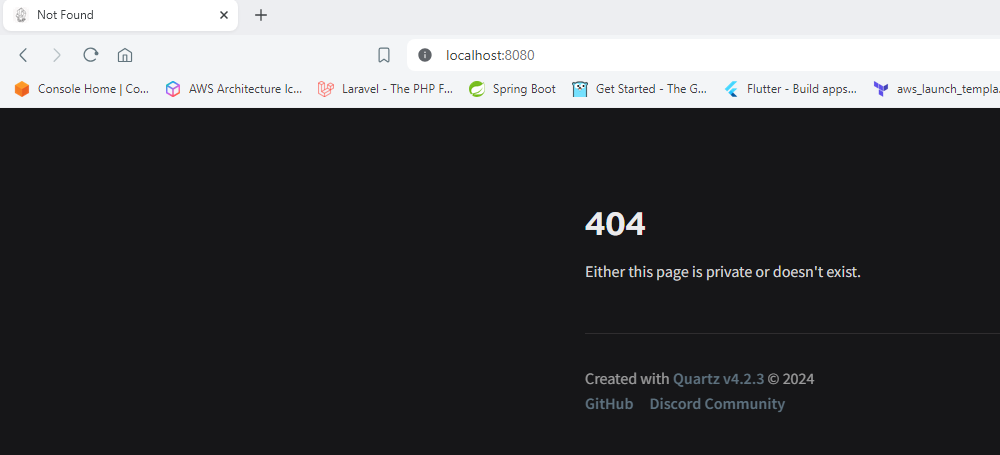

Agora que nosso blog está rodando, vamos pular para a configuração do Obsidian, depois voltamos para nosso editor e faremos algumas alterações em nosso projeto. Pois como você pode ver, como não há conteúdo na pasta  **/content** do nosso repositório essa mensagem de 404 é lançada.


# Configurando o Obsidian

Estou pressupondo que você já fez a instalação do Obsidian e o configurou, não vou me ater a formatação e usabilidade da ferramenta pois já tem bastante conteúdo na internet sobre isso, nosso ponto principal aqui é a criação de um novo cofre. 

1- Abra o Obsidian e selecione opção:

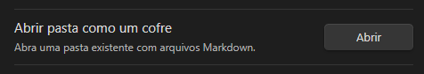

2 - Após clicar nessa opção navegue até pasta de nosso projeto/repositório git que fizemos o clone e selecione a pasta **content**, isso fará que tudo que criarmos agora em nosso Obsidian será salvo na pasta do nosso projeto onde o Quartz buscará o conteúdo para gerar nosso blog.

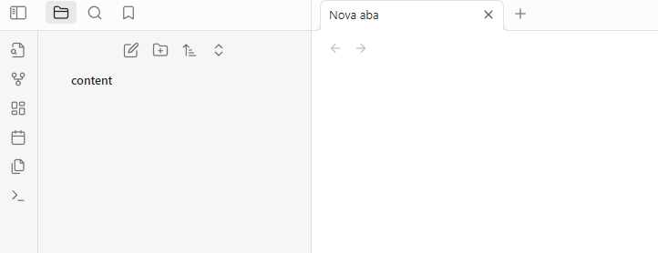

3 - Para verificar que tudo ocorreu bem, comece criando um arquivo com um conteúdo, crie um arquivo com o nome **index** pois o Quartz precisa que este arquivo esteja presente. Depois crie um segundo arquivo com o nome de sua preferência
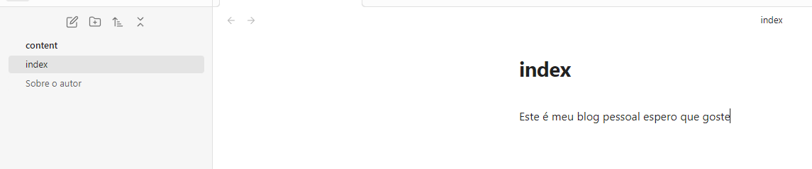

4- Após ter criando alguns arquivos volte para seu editor de código e verifique a pasta contente, deve aparecer os arquivos de configuração do Obsidian e os arquivos que você criou.

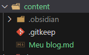

5 - Agora que os arquivos estão sendo salvos no lugar adequado vamos conferir o resultado em nosso navegador, recarregue página e  veja que nosso blog já está funcionando. Para teste crie novos pasta/arquivos/conteúdo e veja a mágica acontecer. 
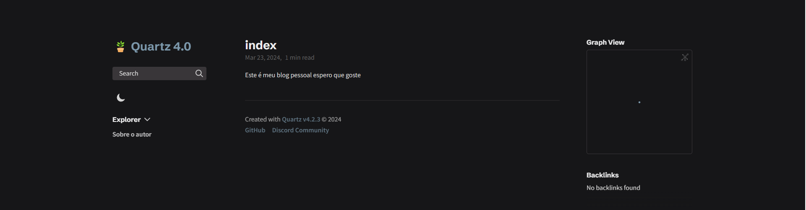

# Removendo arquivos do projeto

Como realizamos um fork do repositório principal, há alguns arquivos que precisamos remover/modificar que não usaremos e que serverm para
gerenciamento do projeto principal. Segue a lista a abaixo:

1 - Remover a pasta **docs** (fica a seu críterio)
2 - Editar o README.md 
3 - Remover todos os arquivos da pasta **.github**


# Configurando Github Pages

Agora vamos realizar a configuração do Github Pages para que possamos publicar nosso blog estatico online, siga os passos a baixo.

1 - Entre em seu repositório, para isso clique na aba **Settings**

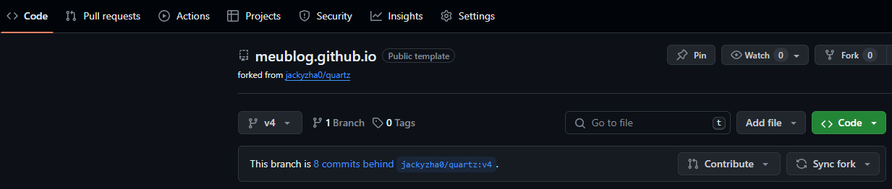

2 - No menu lateral esquerdo na seção **Code and automation** clique na aba **Pages**, na imagem abaixo a última opção.

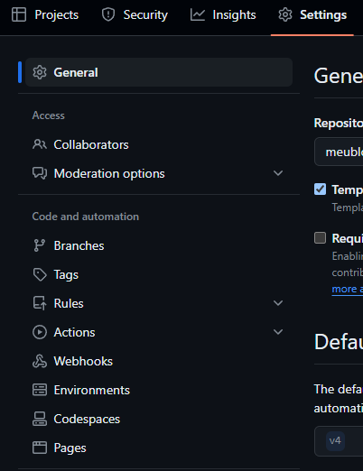

3 - Na pagina do Github Pages você deve fazer alguma configurações, aprimeira e mais importante é selecionar a origin em nosso **Build and deployment** no nosso caso estaremos utilizando o Github Actions, por isso o selecione.

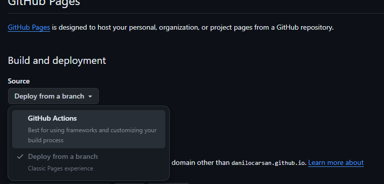

4 - Agora vamos configurar o arquivos de **build e deploy**, em nosso vscode na pasta **.github** crie uma pasta chamada  **workflows** e depois crie um arquivo dentro dessa pasta chamado **deploy.yml**.

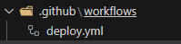

4 - Agora cole o seguinte conteúdo dentro do arquivo **deploy.yml**, esse arquivo contem ás configurações de build e deploy de nosso blog, elas são utilizadas pelo Github Actions para mais informações e detalhes você pode estar lendo a documentação:

GitHub Actions: https://github.com/features/actions
Github Pages: https://pages.github.com/
Quartz: https://quartz.jzhao.xyz/hosting

````
name: Deploy Quartz site to GitHub Pages
 
on:
  push:
    branches:
      - main
 
permissions:
  contents: read
  pages: write
  id-token: write
 
concurrency:
  group: "pages"
  cancel-in-progress: false
 
jobs:
  build:
    runs-on: ubuntu-22.04
    steps:
      - uses: actions/checkout@v3
        with:
          fetch-depth: 0 # Fetch all history for git info
      - uses: actions/setup-node@v3
        with:
          node-version: 18.14
      - name: Install Dependencies
        run: npm ci
      - name: Build Quartz
        run: npx quartz build
      - name: Upload artifact
        uses: actions/upload-pages-artifact@v2
        with:
          path: public
 
  deploy:
    needs: build
    environment:
      name: github-pages
      url: ${{ steps.deployment.outputs.page_url }}
    runs-on: ubuntu-latest
    steps:
      - name: Deploy to GitHub Pages
        id: deployment
        uses: actions/deploy-pages@v2
````

5 - Depois do passo anterior faça o commit das alterações realizadas e envie para o Github

````
git  add -A
git commit -m "configurando github actions"
git push
````

6 - Se você entende um pouco do Github Actions e também de  uma olhada no arquivo, percebeu que nosso Gihub Actions
não foi executado, isso correu porque quando você fez o fork do repositório principal a branch principal do repositório é a **v4**, para deixar-mos como principal a branch **main** vamos criar um nova branch.

````
git branch main
git checkout main
git push origin main
````

7 - Entrando na aba **actions** do repositório você verá que nosso action foi executada porém no passo de deploy ocorreu um erro.
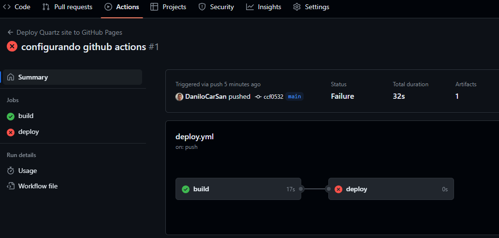

8 - Para corrigir isso vamos definir a branch **main** como nossa branch principal. Na opção **Default branch** escolha a **main**, selecionando a opção **switch to another branch**
 
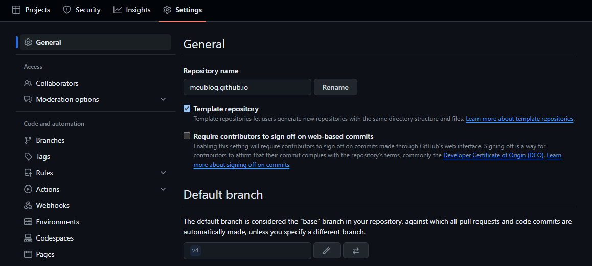

9 - Depois de criáda e definida como principal a branch main, você deve ir na aba **Settings** e secionar a seção 
**Environments** hávera uma já criáda exclua para que possamos criar outra, pois a atual está configurada para a branch antiga a **v4**.

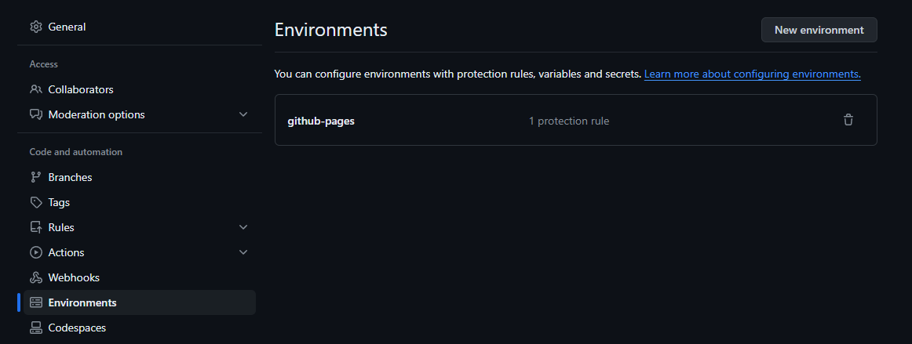

10 - Agora que não há nenhum ambiente configurado clique em **New environment**

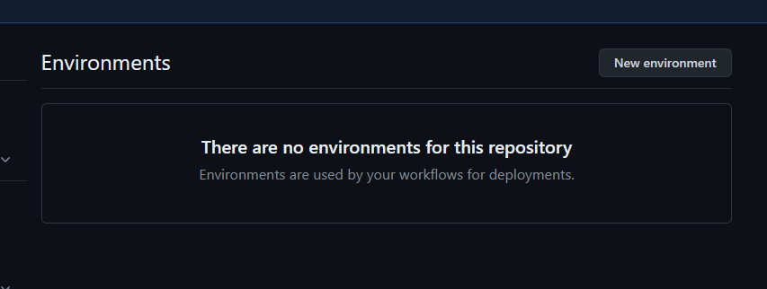

11 - Agora de um nome ao seu ambiente, no meu caso estou dando o nome de: **github-pages**

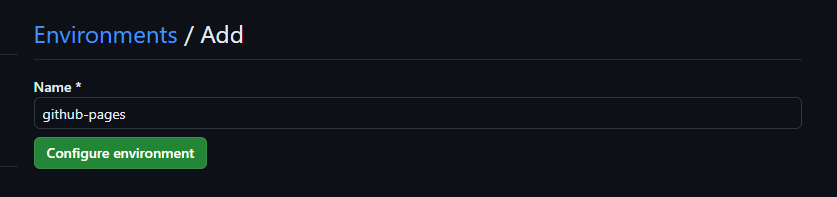

12 - Após criádo seu ambiente precisamos definir a branch para esse ambiente, para fazer isso
dentro do ambiente que foi criádo no passo anterior, na seção **Deployment branches and tags**
clique no botão **No restriction** e depois selecione **Selected branchs and tags**.

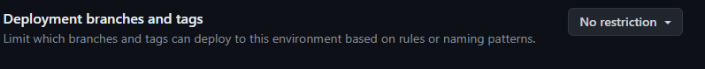

13 - Agora adicione a branch main clicando na opção **Add deployment branch or tag rule**

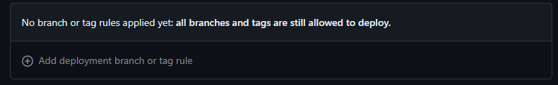
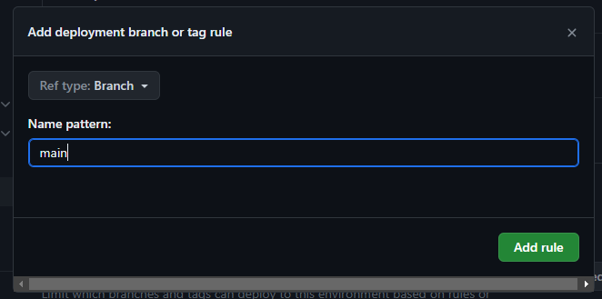

14 - Como último passo volte até a aba **Actions** do seu repositório então selecione o workflow que deu falha

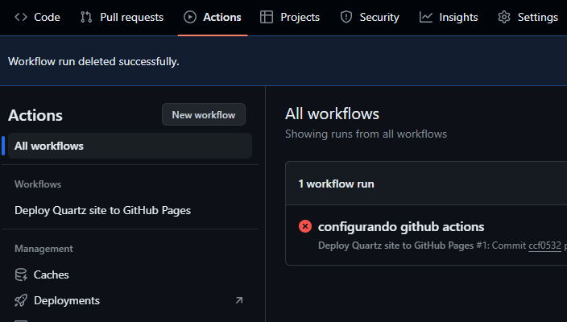
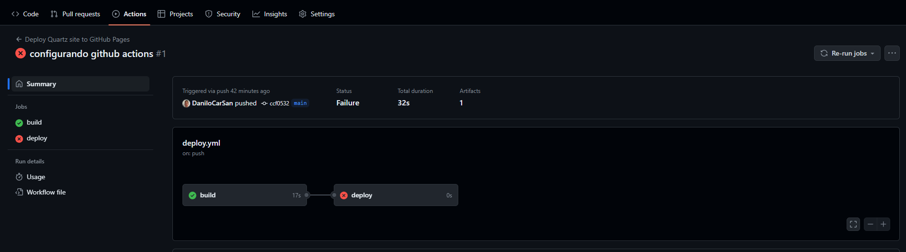

15 - No canto superior direito clique em **Re-run jobs** então selecione a opçao **Re-run all jobs**, então seus trabalhos serão executados novamente.

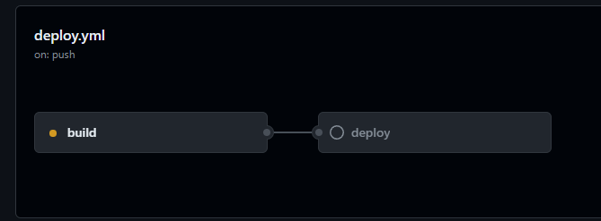


Parabéns seu blog foi publicado, para acessar clique no link mostrado no card do deploy, agora é só seguir o fluxo de alteração e ir publicando em seu blog. Para saber como personalizar seu blog de uma olhada na documentação do Quartz, comenta abaixo de tiver alguma duvida. De dicas de melhorias caso tenha, pois essa é minha primeira publicação, no mais muito obrigado por ter chegado até aqui espero ter agregado em algo.

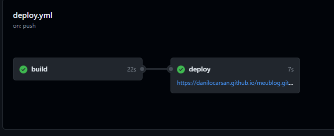

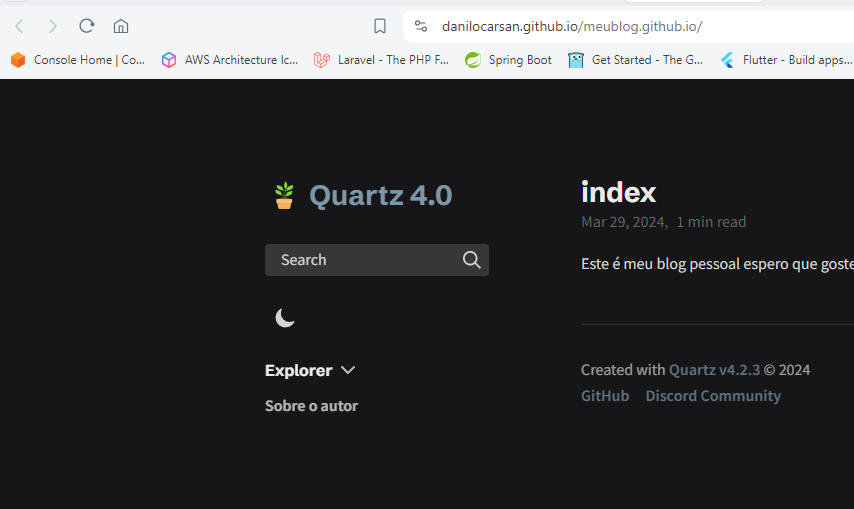